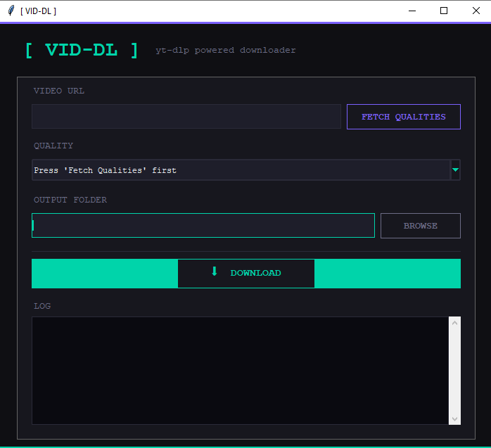

# [ VID-DL ]

> VID-DL es un programa en desarrollo de código abierto impulsado por yt-dlp, con GUI y hecho en Python, para descargar vídeos de internet mediante las políticas de YT-DLP.
> 


---

## Características

- **Obtención de calidades disponibles** — lista todas las resoluciones de cualquier URL antes de descargar
- **Selector de calidad** — elige desde `Mejor disponible (auto)` hasta la resolución más baja
- **Instalación automática de dependencias** — instala `yt-dlp` e `imageio-ffmpeg` on the fly si no se tienen ya
- **Descarga de subtítulos** — obtiene subtítulos en `ca` y `es` cuando están disponibles
- **Selector de carpeta de destino** — se guarda en el Escritorio por defecto, totalmente configurable
- **Panel de log en tiempo real** — el progreso de descarga se muestra directamente en la interfaz

---

## Captura de pantalla





---

## Requisitos

- Python **3.10+**
- `tkinter` (incluido con Python estándar en Windows/macOS; en Linux: `sudo apt install python3-tk`)
- `yt-dlp` — se instala automáticamente si no está disponible
- `ffmpeg` — se usa para fusionar streams; utiliza `imageio-ffmpeg` como alternativa si no está en el PATH

---

## Instalación

```bash
# Clona el repositorio
git clone https://github.com/Igniii/vid-dl.git
cd vid-dl

# Ejecútalo directamente — sin instalación adicional
python vid-dl.py
```

> `yt-dlp` se instalará automáticamente en el primer uso si no está disponible.

---

## Uso

1. **Pega la URL del vídeo** en el campo de URL (YouTube, Twitter/X, Instagram y [muchos más](https://github.com/yt-dlp/yt-dlp/blob/master/supportedsites.md))
2. Haz clic en **FETCH QUALITIES** para obtener las resoluciones disponibles
3. Selecciona la calidad deseada en el desplegable
4. Elige la **carpeta de destino** (por defecto tu Escritorio)
5. Haz clic en **⬇ DOWNLOAD** y sigue el progreso en el log

---

## Contribuir

Los pull requests son bienvenidos. Para cambios importantes, abre primero un issue para comentar qué te gustaría modificar.

---

## Licencia

[MIT](LICENSE)

---

<p align="center">
  Desarrollado con <a href="https://github.com/yt-dlp/yt-dlp">yt-dlp</a> + Python tkinter
</p>
